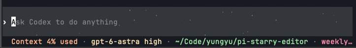
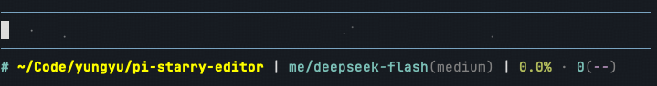

# pi-sparkle

为 [Pi coding agent](https://github.com/earendil-works/pi) 输入框添加轻柔闪烁的星光背景，灵感来自 **Codex Astra Sparkle**。

A subtle sparkling background for the Pi editor, inspired by Codex Astra Sparkle.

灵感来自 Codex 输入框中的闪烁星点（sparkle / starfield），其[源码称之为 Astra Sparkle](https://github.com/openai/codex/blob/5c5308fc9a9ee789049d646ef11e5400384b9c6f/codex-rs/tui/src/bottom_pane/chat_composer.rs#L157)。本扩展借鉴它的星点和闪烁策略，并支持持续显示、自定义密度和速度。

Inspired by the sparkling starfield in the Codex input box (called *Astra Sparkle* in its source code). This extension borrows its star placement and twinkle strategy, and adds always-on display plus configurable density and speed.

## 预览 / Preview

Codex Astra Sparkle 参考效果 / Reference effect from Codex:



Pi 扩展实际效果 / Actual effect in Pi:



## 特性 / Features

- 使用盲文单点字符提供一个字符格内的 8 个亚格位置
- 使用坐标哈希生成稳定星图，不保存逐星状态
- 每颗星使用独立相位和周期，亮度通过 `sin^12` 脉冲变化
- 默认闪烁策略对齐 Codex Astra Sparkle：4~7 秒周期、`0.04` 可见阈值、`0.55` 峰值亮度、150ms 帧间隔
- 星点只替换编辑器渲染结果中的空白 cell，不覆盖输入文字、光标、宽字符和已有背景样式
- 输入框有内容时默认仍保留星场；可通过 `onlyWhenEmpty` 切换为 Codex 式空输入框模式
- 支持 `/reload` 和 `session_shutdown` 清理动画定时器

- Braille dot glyphs provide 8 sub-cell positions per character cell
- A stable star field is derived from a coordinate hash — no per-star state is stored
- Each star has its own phase and period; brightness follows a `sin^12` pulse
- Default twinkle strategy matches Codex Astra Sparkle: 4–7 s period, `0.04` visibility threshold, `0.55` peak brightness, 150 ms frame interval
- Stars only replace blank cells in the editor render output — never input text, the cursor, wide characters, or existing backgrounds
- The star field stays visible while typing by default; set `onlyWhenEmpty` for Codex-style empty-input-only mode
- Animation timers are cleaned up on `/reload` and `session_shutdown`

## 安装 / Install

**npm（推荐 / recommended）**

```bash
pi install npm:pi-sparkle
```

**GitHub**

```bash
# 锁定版本 / pinned to a release
pi install git:github.com/yungyu16/pi-sparkle@v1.0.0

# 跟随默认分支 / tracks the default branch
pi install git:github.com/yungyu16/pi-sparkle
```

也可以直接写入 Pi 配置（`~/.pi/agent/settings.json`）/ or add it to your Pi settings:

```json
{
  "packages": [
    "npm:pi-sparkle"
  ]
}
```

安装后重新启动 Pi；已经运行的会话可以执行 `/reload`。带 `@v1.0.0` 的安装会固定在该版本。

Restart Pi after installing, or run `/reload` in a running session. Installs pinned with `@v1.0.0` stay on that version.

## 配置 / Configuration

默认配置文件 / Default config file:

```text
~/.pi/agent/extensions/pi-sparkle.json
```

默认内容 / Defaults:

```json
{
  "enabled": true,
  "density": 5,
  "speed": 1,
  "peakBrightness": 0.55,
  "onlyWhenEmpty": false
}
```

配置项 / Options:

| 配置项 | 作用 | 默认值 | 有效范围 |
|---|---|---:|---|
| `enabled` | 是否启用星场 | `true` | `true` / `false` |
| `density` | 候选密度分母，`5` 约等于每 5 个空白格选 1 个 | `5` | `1`~`20` 的整数 |
| `speed` | 闪烁速度倍率，`1` 对齐 Codex | `1` | `0.25`~`4` |
| `peakBrightness` | 峰值亮度 | `0.55` | `0.05`~`1` |
| `onlyWhenEmpty` | 是否仅在输入框为空时显示 | `false` | `true` / `false` |

`density` 越小星点越多；`speed` 越大闪烁越快；`peakBrightness` 越大星点越明显。内部的最小亮度阈值、脉冲指数和帧间隔保持 Codex 策略，不作为配置项暴露。

Lower `density` = more stars; higher `speed` = faster twinkle; higher `peakBrightness` = more visible stars. The internal minimum brightness threshold, pulse exponent, and frame interval stay aligned with Codex and are not exposed as options.

也可以在 Pi 内直接配置 / Or configure in-session with `/starfield`:

```text
/starfield status
/starfield on
/starfield off
/starfield reset
/starfield set density 5
/starfield set speed 0.75
/starfield set peakBrightness 0.55
/starfield set onlyWhenEmpty true
```

命令会校验并写回配置文件，然后立即更新当前编辑器。配置路径可以通过 `PI_SPARKLE_CONFIG` 覆盖，Pi 配置根目录也会遵循 `PI_CODING_AGENT_DIR`。

Commands validate the value, persist it to the config file, and apply it to the live editor immediately. Override the config path with `PI_SPARKLE_CONFIG`; the Pi config root also honors `PI_CODING_AGENT_DIR`.

启动级开关 / Startup switch:

```bash
PI_STARFIELD=0 pi
```

扩展只在 Pi 检测到真彩色终端时启动。若终端支持真彩色但环境探测没有识别，可以强制开启：

```bash
PI_TRUE_COLOR=1 pi
```

The extension only starts when Pi detects a truecolor terminal. Force detection on with `PI_TRUE_COLOR=1`.

## 行为边界 / Boundaries

扩展不会拦截或改写键盘输入，也不会改变编辑器文本。它只在 `CustomEditor.render()` 阶段扫描已经生成的 ANSI 行，并把符合条件的空格替换成同样宽度的盲文点：

The extension never intercepts keyboard input or mutates editor text. It only post-processes the ANSI lines already produced by `CustomEditor.render()`, replacing qualifying blanks with equally wide braille dots:

- 跳过 ANSI、OSC、APC 等转义序列 / skips ANSI, OSC, and APC escape sequences
- 跳过光标反显区域和带背景色的区域 / skips cursor inversion and cells with existing backgrounds
- 跳过非空字符和宽字符占用的列 / skips non-blank characters and wide-char columns
- 保持每一行的可视宽度不变 / keeps each line's visible width unchanged
- 真彩色不可用时不启动动画 / no animation without truecolor

## 实现结构 / Implementation

```text
src/
  index.ts              配置、/starfield 命令、CustomEditor 生命周期和扩展入口
  config.ts             配置文件读取、校验、持久化和默认值
  starfield-core.ts     ANSI 行处理、坐标哈希、颜色混合和闪烁曲线
tests/
  config.test.ts        配置默认值和范围校验
  starfield-core.test.ts ANSI、宽字符、样式保护和闪烁逻辑测试
```

Pi 的 TUI 组件返回带 ANSI 的行字符串，而不是 Codex 使用的逐格 buffer。因此渲染内核先跳过 ANSI/OSC/APC 序列，再按 grapheme 和可视列扫描普通文本。这个项目借鉴了 Codex 的 Astra Sparkle 思路，但不依赖 Codex 源码，也不修改 Pi 核心包，只通过 `ctx.ui.setEditorComponent()` 注册自定义编辑器。

Pi's TUI components return ANSI-encoded line strings instead of Codex's per-cell buffer, so the renderer skips escape sequences first, then scans plain text by grapheme and visible column. The project borrows the Astra Sparkle idea from Codex without depending on Codex sources or modifying Pi core — it only registers a custom editor via `ctx.ui.setEditorComponent()`.

## 开发 / Development

项目通过 `.npmrc` 固定使用 npm 官方公共源 `https://registry.npmjs.org/`，锁文件中的依赖下载地址也使用该源。需要 Node.js 22.6 或更新版本：

Requires Node.js 22.6+. `.npmrc` pins the public npm registry.

```bash
npm install
npm test
npm run typecheck
npm pack --dry-run
```

本地试用当前源码 / Try the local source without installing:

```bash
pi -e ./src/index.ts
```

在当前 Pi 配置中临时使用本地目录（`~/.pi/agent/settings.json`）/ or point your Pi settings at the local directory temporarily:

```json
{
  "extensions": [
    "/absolute/path/to/pi-sparkle/src/index.ts"
  ]
}
```

## 发布 / Releasing

发布前确认 / Pre-publish checks:

```bash
npm test
npm run typecheck
npm pack --dry-run
```

包入口由 `package.json` 的 `pi.extensions` 声明，运行时依赖通过 `peerDependencies` 提供，不要把 Pi 核心包打进扩展。发布到 npm 后，带 `pi-package` 关键字的包会自动出现在[官方目录](https://pi.dev/packages)。

The entry point is declared via `pi.extensions` in `package.json`; Pi core packages stay in `peerDependencies` and are never bundled. Once published, the `pi-package` keyword makes the package appear automatically in the [official gallery](https://pi.dev/packages).

## 兼容性 / Compatibility

- Pi `0.86.0+`
- Node.js `22.6+`
- 依赖 `setEditorComponent` custom editor API / requires the `setEditorComponent` custom editor API
- 推荐使用支持 24-bit ANSI color 的终端，例如 iTerm2、Ghostty、Kitty、WezTerm 或 VS Code Terminal / a 24-bit truecolor terminal is recommended (iTerm2, Ghostty, Kitty, WezTerm, VS Code Terminal)

## License

MIT
